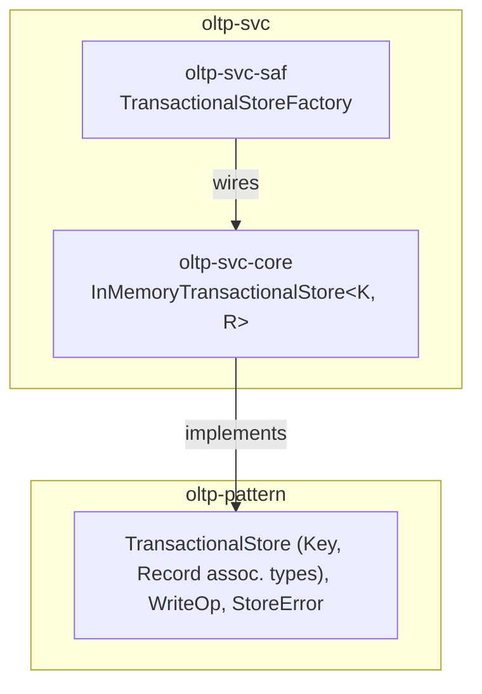

# oltp-svc Architecture

**Audience**: Architects, technical leads, contributors.

## Overview

Two crates — one `core` reference implementation, one `saf` facade. No
`spi` crate yet:

- **`oltp-svc-core`** — the technology-free reference implementation:
  `InMemoryTransactionalStore` (a single `std::sync::RwLock<HashMap<..>>`,
  no persistence, no distributed coordination). See
  [ADR-001](adr/ADR-001-in-memory-reference-implementation.md) for the
  implementation-shape reasoning.
- **`oltp-svc-saf`** — `TransactionalStoreFactory` (`in_memory::<K, R>()`,
  always available — no feature gate, since there's only one backend). A
  consumer depends on `oltp-pattern` + `oltp-svc-saf` alone.

## `TransactionalStore` is not object-safe — `TransactionalStoreFactory` is a generic function, not a boxed-return factory

Until `oltp-pattern` v0.2.0, `TransactionalStore` had no generic
parameters and was fully object-safe, and `TransactionalStoreFactory::in_memory()`
returned `Box<dyn TransactionalStore>` uniformly, matching
`message-broker-svc-saf`'s `MessageBrokerFactory` and `scheduler-svc-saf`'s
`SchedulerFactory` shape. That changed when `TransactionalStore` moved to
`type Key`/`type Record` associated types (see
[oltp-pattern#5](https://github.com/sweengineeringlabs/oltp-pattern/issues/5)
and that repo's own architecture.md) to stop forcing every in-process
caller through an opaque `Vec<u8>` payload it didn't need — a trait with
associated types isn't object-safe at all, regardless of its methods'
generic parameters, so `Box<dyn TransactionalStore>` no longer exists to
return.

`TransactionalStoreFactory::in_memory` is now a generic function:

```rust
pub fn in_memory<K, R>() -> impl TransactionalStore<Key = K, Record = R>
where
    K: Send + Sync + Clone + Eq + std::hash::Hash + 'static,
    R: Send + Sync + Clone + 'static,
```

A caller picks its own concrete key/record types (`TransactionalStoreFactory::in_memory::<String, Order>()`),
and pays zero serialization cost for it — the whole point of the change.
This is not the same shape as `executor-svc-saf`'s `ExecutorFactory`
(`impl Executor` per constructor because `Executor::run<F: Future>` is
generic on the *method*, still one fixed `Executor` implementation per
constructor) — here the *type itself* is generic, chosen by the caller,
not the implementation.

## Component Diagram



## Why a single `RwLock`, not per-key locks

See [ADR-001](adr/ADR-001-in-memory-reference-implementation.md). One
`RwLock<HashMap<K, R>>` guarding the whole table means `write_batch` is
trivially, correctly atomic — every op in the batch applies under one
write-lock acquisition, so no other reader or writer can observe a
partially-applied batch. Per-key locking would need real multi-key locking
discipline (consistent lock ordering to avoid deadlock) to get the same
atomicity guarantee for `write_batch`, for a concurrency win that no real
consumer has asked for yet.

## Why no `spi` crate yet

No real consumer has needed a persistent (survives process restart) or
distributed (coordinates across multiple processes) OLTP backend. Per this
org's own `<domain>-<technology>-spi` convention, an `spi` crate wraps
exactly one external technology — building one speculatively, with no real
technology chosen and no real consumer validating the choice, would be the
same premature-generalization mistake `oltp-pattern`'s own ADR-001 declined
to make for secondary indexes/versioned writes/TTL. Add one when a real
need does.

## Scope boundary

This repo implements exactly `oltp-pattern`'s `TransactionalStore` trait,
one backend. Not covered:

- **Persistent/distributed OLTP backends** — no `spi` crate yet, see above.
- **Per-key locking / finer-grained concurrency** — considered and
  deferred, see ADR-001's own reasoning.
- **Declarative queries over the whole dataset** — that's `olap-svc`'s
  `AnalyticalStore` implementation, a separate companion repo pair.

[← Docs index](../README.md)
